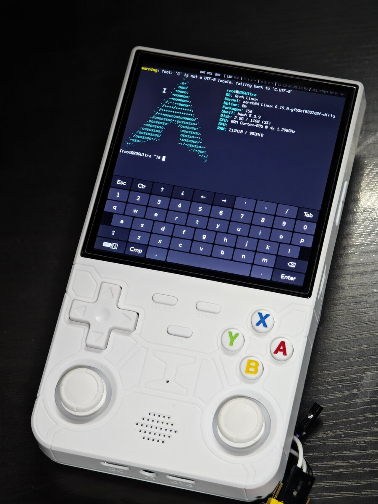

# R36Ultra 用 Arch Linux ARM

R36Ultra（Rockchip RK3326）向けの非公式 Arch Linux ARM。カーネルは mainline Linux 6.19。



## 動作状況

| 機能 | 状態 |
|---|---|
| 画面表示 | 動作 |
| ボタン、アナログスティック | 動作 |
| WiFi、ssh | 動作。大容量の受信でファームウェアのエラー回復が起きる |
| sway、画面キーボード | 動作 |
| 熱管理、RTC、電池残量 | 動作 |
| USB マウス・キーボード（OTG 端子） | 動作 |
| 音声 | 未確認 |
| 音量ボタン | 未確認 |
| GPU 描画 | 未対応。sway は CPU で描画する |

## 書き込み

純正ファームウェアの U-Boot が eMMC に入った R36Ultra と、8GB 以上の SD カードが必要。eMMC には書き込まない。

```sh
xz -dc r36ultra-archlinux.img.xz | sudo dd of=/dev/sdX bs=4M conv=fsync status=progress
```

ログインは `root` / `root`。

## 文書

- [インストール](docs/INSTALL.md): 書き込み、初回起動、WiFi、ssh、更新
- [使い方](docs/USAGE.md): ボタン、キー操作、電源
- [ビルド](docs/BUILD.md): ソースからイメージを作る
- [作業記録](docs/R36Ultra-MainlineLinux.md)

## ライセンス

- このリポジトリのスクリプト・プログラム・設定ファイル: MIT（`LICENSE`）
- カーネルのパッチ、rk915: GPL-2.0
- DTS: GPL-2.0+ または MIT
- wvkbd: GPL-3.0

## 謝辞

- [Arch Linux ARM](https://archlinuxarm.org/)
- [sunshineinabox/rk915](https://github.com/sunshineinabox/rk915)、ROCKNIX
- [wvkbd](https://github.com/jjsullivan5196/wvkbd)
